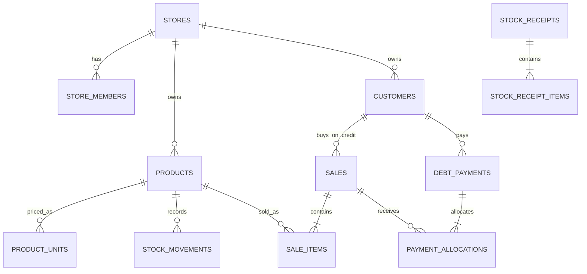

# Thiết kế database — Tạp hóa BIN

## Mục tiêu

Database dùng PostgreSQL qua Supabase. Tiền lưu bằng số nguyên đồng (`bigint`); tồn kho lưu bằng số nguyên theo đơn vị bán nhỏ nhất. Mỗi bảng nghiệp vụ có `store_id` để tách dữ liệu của từng cửa hàng.

Các thay đổi tiền, kho và nợ không được gửi thành nhiều lệnh rời từ giao diện. Frontend gọi một RPC; PostgreSQL thực hiện toàn bộ trong cùng transaction. Nếu một bước lỗi, mọi thay đổi của lệnh đó được rollback.

## Quan hệ chính



## Các bảng

| Bảng | Vai trò |
| --- | --- |
| `profiles`, `stores`, `store_members` | Người dùng, cửa hàng và vai trò owner/staff. |
| `products` | Tên hàng, nhóm, đơn vị kho nhỏ nhất, tồn hiện tại và trạng thái bán. |
| `product_units` | Giá nhập/bán và hệ số quy đổi của `base`, `bag`, `pack`. |
| `stock_receipts`, `stock_receipt_items` | Phiếu nhập và giá nhập tại thời điểm nhập. |
| `stock_movements` | Sổ tăng/giảm kho không xóa cứng. |
| `sales`, `sale_items` | Đơn bán và ảnh chụp tên/đơn vị/giá tại thời điểm bán. |
| `customers` | Thông tin khách, tổng nợ và trạng thái đang xuất hiện trong sổ nợ. |
| `debt_payments`, `payment_allocations` | Lần trả nợ và số tiền được phân bổ vào từng đơn cũ. |
| `audit_logs` | Dấu vết các thao tác quan trọng. |

`customers` không bị xóa vật lý khi trả hết. Cột `is_in_debt_book` chuyển thành `false`, nên giao diện không còn hiển thị khách nhưng đơn và lịch sử vẫn giữ khóa ngoại hợp lệ.

## RPC dùng từ frontend

| Hàm | Mục đích |
| --- | --- |
| `create_store` | Tạo cửa hàng và gán người đăng nhập làm chủ. |
| `save_product` | Tạo/sửa sản phẩm và toàn bộ quy cách trong một lần. |
| `save_customer` | Tạo/sửa khách nhưng không cho frontend sửa trực tiếp số nợ. |
| `receive_stock` | Tạo phiếu nhập, cộng tồn, cập nhật giá nhập và ghi biến động kho. |
| `create_sale` | Khóa sản phẩm, kiểm tra tồn, dùng giá trong DB, tạo đơn, trừ kho và tăng nợ nếu mua chịu. |
| `record_debt_payment` | Khóa khách, nhận tiền và phân bổ vào đơn nợ cũ nhất trước. |
| `cancel_sale` | Hoàn kho, giảm phần nợ chưa trả, tính phần tiền cần hoàn và giữ dấu vết hủy. |

`client_request_id` bắt buộc cho nhập kho, bán hàng và trả nợ. Frontend tạo một UUID khi người dùng bắt đầu bấm xác nhận và dùng lại UUID đó nếu phải gửi lại. DB chỉ tạo giao dịch một lần, giúp chống bấm hai lần hoặc mạng gửi lặp.

Ví dụ bán hai thùng nước trả ngay:

```js
const requestId = crypto.randomUUID();
const { data, error } = await supabase.rpc('create_sale', {
  p_store_id: storeId,
  p_request_id: requestId,
  p_payment_type: 'cash',
  p_customer_id: null,
  p_items: [{ product_id: productId, unit_key: 'pack', quantity: 2 }],
});
```

Frontend chỉ gửi `product_id`, `unit_key`, `quantity`. Giá, hệ số quy đổi và tồn kho được đọc lại trong DB để người dùng không thể sửa giá hoặc số tồn qua request.

## Bảo mật

- Mọi bảng public đã bật Row Level Security.
- Người đăng nhập chỉ đọc được dòng thuộc cửa hàng mà họ là thành viên.
- Bảng giao dịch chỉ cho frontend đọc; thay đổi phải đi qua RPC.
- `products`, `product_units`, `customers` cũng thay đổi qua RPC để frontend không thể sửa thẳng tồn hoặc nợ.
- RPC kiểm tra `auth.uid()` và tư cách thành viên trước khi xử lý.
- Frontend chỉ dùng publishable/anon key. Không đưa service-role key vào Vite hoặc trình duyệt.

## File và cách chạy tại máy

- `supabase/migrations/202609210001_initial_store_schema.sql`: bảng, ràng buộc, trigger, RLS và quyền.
- `supabase/migrations/202609210002_transaction_functions.sql`: nhập kho, bán hàng, trả nợ, hủy đơn và hai view đọc dữ liệu.
- `supabase/migrations/202609210003_catalog_functions.sql`: tạo/sửa khách và sản phẩm.
- `supabase/seed.sql`: dữ liệu thử cho sáu nhóm hàng.
- `supabase/tests/store_transactions.test.sql`: kiểm tra transaction, chống gửi lặp, chống bán vượt tồn, trả nợ và hủy đơn.

Máy cần Docker Desktop đang chạy:

```sh
npm run db:start
npm run db:reset
npm run db:test
```

Sau khi tạo project Supabase thật và liên kết CLI:

```sh
npx supabase link --project-ref YOUR_PROJECT_REF
npx supabase db push --dry-run
npx supabase db push
```

`db push --dry-run` giúp xem migration trước khi áp dụng. Chỉ chạy `db push` lên project phát triển trước; chưa dùng dữ liệu cửa hàng thật cho đến khi frontend được nối và kiểm thử đầy đủ.
